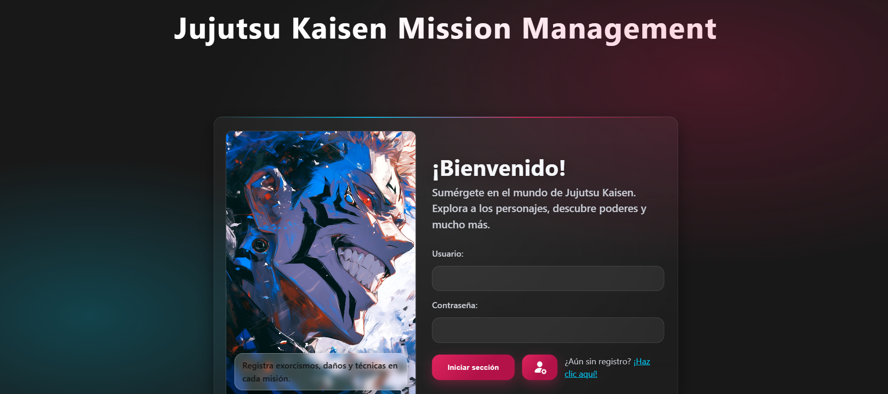
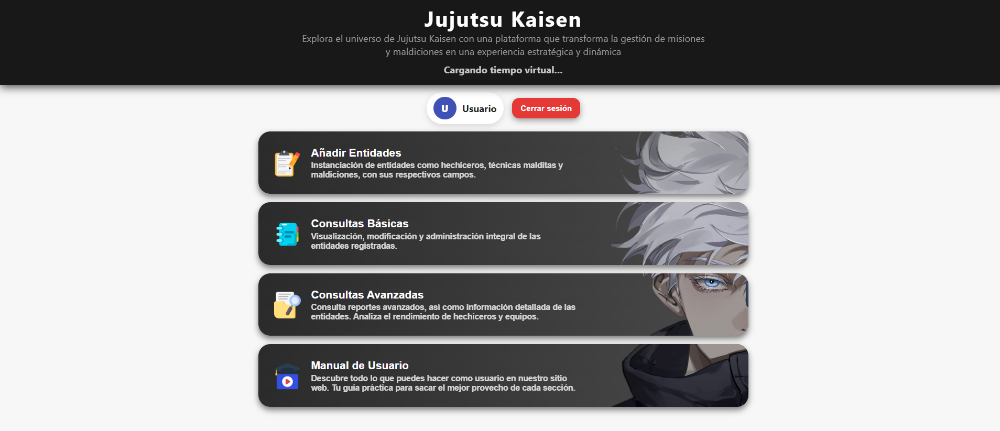

# 🧙‍♂️ Jujutsu Kaisen Mission Management ⚙️💻🛠️🔧



Welcome! ✨🚀💻 This project manages missions, curses, techniques and resources inspired by the Jujutsu Kaisen universe. It provides a technical toolset and observability-ready features for engineers and maintainers:

- 📝 Curse registration and automatic mission generation 🧪🔁
- 🧭 Team assignment, mission lifecycle (start/close), and automated mission progression ⚙️🔄
- 📊 Advanced queries (ranking, success in a date range, per-sorcerer history) 🧮📈
- 📡 Real-time events for dashboards and notifications via Socket.IO 🔔🔗
- 🧪 REST API with OpenAPI documentation and automated tests 🧰🧩
- ⚙️ Designed for testability, maintainability, and observability (logs, metrics) 🔍📈

A quick look at the home section



This repository follows a clear N-layer architecture and is built to be testable and maintainable. 🛠️🔎🔥

---

## Table of Contents 🧭🔎

- Project overview 📘
- Architecture 🏗️
- Technology stack 🧰
- Project layout 🗂️
- Mission states 🔁
- Key endpoints & events 🔌
- Running locally 🖥️
- Environment variables 🔐
- Scripts 🧩
- Testing 🧪
- Linting & formatting 🧹
- Database & migrations 🗄️
- Contributing 🤝
- Further reading 📚

---

## Project overview 📘

Core goals:

- Centralize mission and participant management 🧭
- Automatically create missions when a curse is reported ⚡🔁
- Provide advanced analytics and ranking engines 📊🧮
- Expose a stable REST API with OpenAPI docs and unit/integration tests 🧪

Typical request flow:

1. HTTP request reaches [js/routes/index.js](js/routes/index.js#L1) 🔗
2. Controller validates and orchestrates the call 🧭
3. Service implements business rules (assignment, state transitions) ⚙️
4. Repository layer talks to TypeORM and the database 🗄️
5. Entities live in `database_tables/` 🧩

Another quick snapshot of the flow


## Architecture 🏗️

This is an N-layer app:

- Routes → Controllers → Services → Repositories → ORM / Entities 🔁

Benefits: separation of concerns, easier testing, and predictable boundaries. ✅🔒

## Technology stack 🧰

- Runtime: Node.js (recommended 18+) 🟢
- Framework: Express.js ⚡
- ORM: TypeORM (EntitySchema style JS entities) 🧩
- Database driver: `mysql2` (MySQL / MariaDB) 🗄️
- Real-time: Socket.IO 📡
- Validation: `zod` (used across services) 🎯
- Security: `helmet`, `express-rate-limit`, `cors` 🔐
- Environment: `dotenv` 🌱
- PDF generation: `jspdf` 📜

Dev & testing tools:

- Test runner: Jest + Supertest 🧪🧰
- Linting: ESLint 🧹
- Formatting: Prettier 🎨
- Dev server: nodemon 🔁

Main dependencies (see [package.json](package.json#L1)):

- express, typeorm, mysql2, socket.io, zod, dotenv, helmet, cors ⚙️

Dev dependencies:

- jest, supertest, eslint, prettier, nodemon 🧪

## Project layout (high level) 🗂️

- `js/server.js` — application entrypoint and DB connection ([open file](js/server.js#L1)) 🖥️
- `js/routes/` — route registration 🔀
- `js/controllers/` — request handlers 🧭
- `js/services/` — business logic (assignment, ranking, mission progression) ⚙️
- `js/repositories/` — data access helpers 🗃️
- `database_tables/` — TypeORM entity schemas 🧩
- `scripts/` — helper scripts (seed, schema apply, smoke tests) 🛠️
- `tests/` — unit & integration tests (Jest) 🧪
- `docs/openapi.yaml` — OpenAPI spec 📘

## Mission states 🔁

- `pendiente` — pending ⏳
- `en_ejecucion` — in progress ▶️
- `completada_exito` — completed (success) ✅
- `completada_fracaso` — completed (failure) ❌
- `cancelada` — cancelled ⛔

## Key endpoints & events 🔌

Example endpoints (see API spec in [docs/openapi.yaml](docs/openapi.yaml)):

- `POST /curses` — create a curse and auto-generate a mission ⚡📝
- `POST /missions/:id/start` — start a mission ▶️
- `POST /missions/:id/close` — close a mission with result 🏁
- `GET /missions/sorcerer/:id` — list missions a sorcerer participated in 🧭
- `GET /missions/success-range?from=ISO&to=ISO` — success within date range 📅📈

Real-time events emitted via Socket.IO:

- `mission:created`, `mission:started`, `mission:progress`, `mission:closed` 🔔📡

## Authentication note 🔐

Current repository includes a simple demo auth middleware at [js/middleware/authMiddleware.js](js/middleware/authMiddleware.js#L1) that expects a header `x-usuario` for demo purposes. Replace with a proper auth mechanism (JWT, sessions, OAuth) for production. 🔑

## Running locally 🖥️

Prerequisites:

- Node.js 18+ and npm 🟢
- MySQL-compatible database (MySQL, MariaDB). A local Docker container is recommended in development 🐳

Quick start:

1. Install deps:

```
npm install
```

2. Create a `.env` file in the project root (example shown below).

3. Run the app in development:

```
npm run dev
```

Production start:

```
npm start
```

### Example `.env` (development) 🔧

```
PORT=3000
NODE_ENV=development
DB_HOST=localhost
DB_PORT=3306
DB_USER=root
DB_PASSWORD=your_db_password_here
DB_NAME=jujutsu_misiones_db
CORS_ORIGIN=http://localhost:3000
RATE_LIMIT_MAX=1000
```

Important: `js/server.js` uses `synchronize: true` for TypeORM by default — this will auto-sync entities to schema and can be destructive for production databases. Disable synchronize and use proper migrations for production. ⚠️

## Scripts 🧩

Key npm scripts (see [package.json](package.json#L1)):

- `npm run dev` — start dev server with nodemon 🔁
- `npm start` — production start 🚀
- `npm run setup` — install (alias) 🛠️
- `npm run seed` — run `scripts/seed.js` to populate sample data 🌱
- `npm run smoke` — run `scripts/smoke.js` (basic smoke tests) 🔥
- `npm test` — run Jest tests 🧪
- `npm run lint` / `npm run lint:fix` — ESLint 🧹
- `npm run format` — Prettier 🎨

## Testing 🧪

Unit & integration tests with Jest live under `tests/`. Example single-test run (PowerShell):

```
npm test -- --verbose curseService.test.js
```

CI: Add a workflow that runs `npm ci`, `npm run lint`, and `npm test` on PRs. 🤖

## Database & migrations 🗄️

- ORM: TypeORM with EntitySchema-style JS entities located in `database_tables/`.
- Driver: `mysql2`.
- Seeding: `scripts/seed.js`.
- Warning: `synchronize: true` is enabled in dev by default in `js/server.js` — switch to migrations for production. ⚠️

## Security & best practices 🔒

- Use `helmet`, set strict CORS via `CORS_ORIGIN`, and enable `express-rate-limit` (configured via `RATE_LIMIT_MAX`).
- Do not commit `.env` or credentials. Store secrets in secure vaults in production. 🔐

## Contributing 🤝

- Fork the repo and create feature branches.
- Keep changes small, add tests for new behavior, run lint and format before opening PR.

Recommended local checks before PR:

```
npm run lint
npm test
npm run format
```

## Further reading 📚

- OpenAPI spec: [docs/openapi.yaml](docs/openapi.yaml)
- Main entry: [js/server.js](js/server.js#L1)
- Package manifest: [package.json](package.json#L1)

---

If you want, I can also:

- Add a minimal `docker-compose.yml` for a MySQL + app dev environment 🐳🧩
- Add a GitHub Actions CI workflow (`lint` + `test`) template 🤖
- Harden `js/server.js` for production (disable `synchronize`, add migrations) 🔒

Which of these would you like me to do next?

---

© Project — see repository for license and authorship
